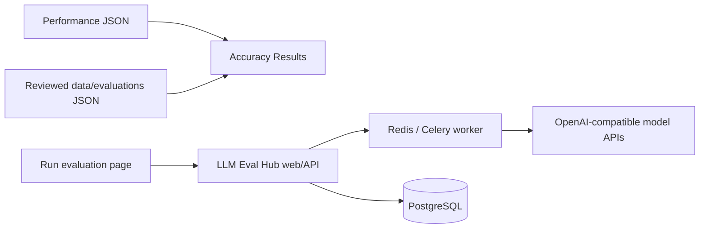

# Accuracy evaluation design

Status: implementation baseline
Last updated: 2026-08-15

This document defines the product and system design for InferStation accuracy
evaluation. Deployment commands live in [`deployment.md`](deployment.md), and
the public result contract lives in
[`../data/evaluations/SCHEMA.md`](../data/evaluations/SCHEMA.md).

## 1. Goals

InferStation has two independent measurement areas:

- **Performance** measures latency and throughput on known hardware and serving
  configurations.
- **Accuracy** measures model quality under immutable dataset and protocol
  versions.

The first Accuracy release provides:

1. `/accuracy`: a public, static accuracy coverage summary aligned with the
   configurations already visible in Performance.
2. `/accuracy/run`: an internal control page that evaluates any reachable
   OpenAI-compatible model API.
3. `services/llm-eval-hub`: the repository-owned backend that registers model
   endpoints, executes datasets, scores responses, and retains operational
   state.
4. `data/evaluations`: reviewed aggregate JSON used by the public static page.

Accuracy CI is deferred. No scheduled accuracy workflow is required, and no
accuracy result is published automatically.

## 2. Information architecture

The primary navigation separates the site overview from its two measurement
areas without changing their data sources:

```text
Overview          /

Performance
  Summary        /summary
  Charts         /charts
  Compare        /compare
  Runs           /runs
  History        /history

Accuracy
  Results         /accuracy
  Run evaluation  /accuracy/run

Docs             /docs
```

The former `/benchmark` and `/benchmark/run` routes remain compatibility
aliases. Existing Performance routes, JSON, filters, charts, run details, and
history remain unchanged.

## 3. Repository structure

```text
InferStation/
├── src/                              Next.js static frontend
├── data/runs/                        Performance source JSON
├── data/evaluations/                 reviewed accuracy JSON and schema
├── services/llm-eval-hub/            accuracy backend and its tests
├── deploy/llm-eval-hub/              host-specific Compose override/example
├── docs/accuracy-benchmark-design.md this design
└── docs/deployment.md                production operations
```

LLM Eval Hub is maintained directly as part of InferStation. It is not a
submodule, generated snapshot, or separately deployed repository.

## 4. Runtime architecture



The frontend and backend are separate deployment units:

- Next.js is statically exported and copied to
  `/home/lkang/inferstation/site`.
- Eval Hub is built from `services/llm-eval-hub` in the server source checkout
  and runs as the `inferstation-eval-hub` Compose project.
- PostgreSQL, Redis, and artifacts use dedicated persistent volumes.
- Static deployment never copies, deletes, or owns backend state.

## 5. Accuracy Results

The Summary is static and must remain usable when Eval Hub is offline.

Its expected coverage is derived from Performance using this identity:

```text
model slug + quantization + host slug + engine slug + backend
```

Performance concurrency and batch-size variants collapse into one quality
configuration. Broken Performance runs do not create expected coverage.

For each configuration, the page shows:

- model, quantization, machine, engine, and backend;
- one primary metric per selected dataset;
- `Published`, `Partial`, or `Missing` coverage state;
- suite and protocol version; and
- a link to the reviewed JSON evidence.

Until a real result is published, one synthetic example is shown with a
prominent Preview label. Missing results are displayed as missing, never as
zero. Version one has no composite score or overall model ranking.

## 6. Interactive run flow

The Run page uses the documented Eval Hub HTTP API:

```text
connect to Eval Hub
  -> register target URL, API model name, and target credential
  -> probe that exact Chat Completions request
  -> select immutable dataset versions
  -> validate request and effective concurrency
  -> acquire the single global run slot
  -> create run with an idempotency key
  -> display queue state and poll sample progress
  -> display metrics or errors
```

Eval Hub permits exactly one non-terminal run across the deployment. The API
serializes submissions with a PostgreSQL transaction advisory lock and rejects
a second task with HTTP 409 while the first is queued, preparing, running,
aggregating, or cancelling. This backend invariant applies across browsers and
after page refreshes; disabling the button in one browser is only a usability
measure. One run may still contain multiple immutable dataset versions.

The Run page reloads the active task on connection and continues polling it
after a refresh. Its queue panel always shows the one task slot, queued/running
state, sample counts, and percentage progress. A queued run has position 1 of 1;
the slot becomes available only when the run succeeds, fails, or is cancelled.

### Live Run history

Every run submitted by `/accuracy/run` carries
`X-EvalHub-Run-Origin: inferstation-live-run`. In the same transaction that
creates the run, Eval Hub adds its ID to the dedicated `live_run_history` SQL
table. `GET /api/v1/runs?live=true&limit=50` returns only this page-owned
history; runs created by other API or administrative workflows are excluded.

The index retains the latest 50 entries. Adding entry 51 removes only the
oldest row from `live_run_history`: the underlying `runs`, `run_datasets`,
`sample_executions`, scores, and metrics remain untouched. The UI states this
boundary explicitly.

On initial load and manual reconnect, the page loads all 50 summaries, selects
the newest entry, reloads its persisted run details, and fetches aggregate
metrics for a successful run. A user can select any listed entry without
rerunning the model. The result view presents:

- status, model, timestamps, sample progress, dataset version, and protocol;
- the primary score with its numerator and denominator;
- API errors, parse errors, and successful-request p50/p95 latency; and
- expandable raw aggregate fields for diagnosis.

On desktop, history and result use an asymmetric master-detail layout: the
scrollable history rail receives about 30% of the width and the result receives
about 70%. On smaller screens they stack vertically, with a bounded history
height so the result remains nearby. Selecting a summary updates the result
identity immediately and shows a loading state while persisted metrics are
fetched.

Scores must be interpreted together with their denominator and error counts.
Latency is operational context, not quality. Smoke results always carry a
warning that they validate the pipeline and cannot support model comparisons.

The target API key is a runtime input. The page does not place it in a URL,
browser storage, Git, logs, or exported JSON, and clears it from form state
after endpoint registration. The internal RTX4090 deployment currently disables
the Eval Hub control-plane key with an explicit setting; the backend retains the
ability to re-enable it before exposure to an untrusted network.

The production page loads registered datasets automatically. It accepts either
an OpenAI-compatible API base URL or a full `/chat/completions`, `/completions`,
or `/models` endpoint and stores the normalized `/v1` base. Saving an existing
endpoint name creates a new immutable revision instead of a duplicate endpoint.
Run validation is unavailable until the endpoint probe is healthy.

The URL, credential, and API model name are one explicit target tuple. The
model name becomes the required `model` field in a minimal
`POST /chat/completions` request. Save & probe tests only that exact call: Eval
Hub does not call the provider's `/models` endpoint, infer other accessible
models, or let the page switch to a different advertised model. The resulting
capability record includes the probed model name. Changing any target field
invalidates that proof and requires Save & probe again. Existing model registry
rows and historical runs are retained and are not rewritten by this change.

Changing an endpoint, model, dataset, or execution parameter invalidates the
previous preflight and idempotency key.

The Run page maps its preflight fields directly to Eval Hub's `RunCreate`
contract. Accuracy-oriented defaults use temperature 0, Top P 1, max output 32,
and seed 42 for deterministic generation. Execution defaults use concurrency 1,
QPS 1, a 300-second request timeout, and two transient retries. Execution
settings improve completion reliability and protect the shared host; they do
not change the scoring protocol. Eval Hub may lower effective concurrency to
the endpoint or deployment limit.

These are run-level overrides sent to every selected dataset. Capability-aware
omission of unsupported provider fields, and per-dataset inference overrides,
remain Eval Hub backend work rather than frontend guessing.

Arbitrary public model services are supported over HTTPS when
`ALLOW_PUBLIC_HTTPS_ENDPOINTS=true`. Private endpoints must be inside an
explicit allowed CIDR. Loopback, link-local, metadata, multicast, embedded
credentials, redirects, query strings, and fragments remain rejected.

## 7. Datasets

Eval Hub owns immutable YAML manifests and JSONL samples. A dataset version
freezes its checksum, prompt, parser, scorer, denominator policy, and error
policy.

Production-quality packs currently include GSM8K Native, MMLU Lite Native, and
MMLU Full Native. MMLU Lite is a subset of MMLU Full and should not be selected
with Full in the same run.

The repository also contains
`inferstation-accuracy-pipeline-smoke-10`, a ten-row synthetic dataset used only
to validate endpoint registration, queueing, parsing, scoring, and UI display.
Its name, display label, description, and tags explicitly prohibit accuracy
reporting. Real model comparisons must never use it.

## 8. Operational and public data

Eval Hub PostgreSQL is the operational source of truth for endpoints,
credentials, active runs, samples, and metrics. Git is the public source of
truth only after a result has been reviewed and converted to the schema under
`data/evaluations`.

```text
Eval Hub terminal run
  -> reviewed adapter/sidecar mapping
  -> draft JSON
  -> schema and secret checks
  -> append-only published JSON
  -> static Summary manifest
```

Published JSON must preserve producer run identity, run fingerprint, dataset
checksums, protocols, denominators, and error counters. It must exclude endpoint
URLs, API keys, private headers, internal database IDs, and unreviewed sample
content.

## 9. Resource isolation

The RTX4090 host also serves GPU workloads. Initial Eval Hub limits are:

```text
worker processes        2
default run concurrency 2
global concurrency      4
default QPS              2
worker CPU quota         2 cores
total steady CPU quota   4 cores
```

The single-active-run API invariant applies to smoke and full evaluations. The
ten-row smoke pack is the required first test; it should use concurrency 1 and
QPS 1. Raise per-run limits only after comparing GPU benchmark latency and
throughput with Eval Hub idle and under load.

## 10. Invariants

- Never modify or delete `data/runs` from Accuracy frontend or backend jobs.
- Never deploy backend files or state under the static `site/` directory.
- Never run `docker compose down -v` during normal operations.
- Never regenerate `SECRET_ENCRYPTION_KEY` for an existing deployment.
- Never overwrite a published evaluation path.
- Never publish the smoke dataset as evidence of model quality.
- Never bypass the single active Live Run slot with direct worker submission.
- Never introduce an accuracy schedule without a separate decision.
