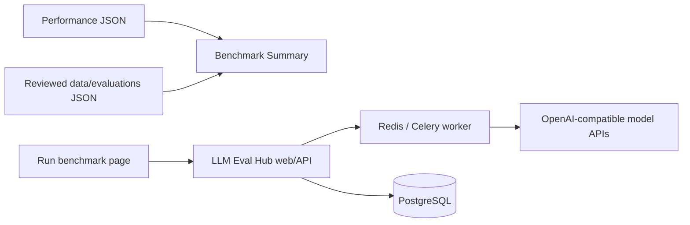

# Accuracy benchmark design

Status: implementation baseline
Last updated: 2026-08-15

This document defines the product and system design for InferStation accuracy
evaluation. Deployment commands live in [`deployment.md`](deployment.md), and
the public result contract lives in
[`../data/evaluations/SCHEMA.md`](../data/evaluations/SCHEMA.md).

## 1. Goals

InferStation has two independent measurement areas:

- **Performance** measures latency and throughput on known hardware and serving
  configurations.
- **Benchmark** measures model quality under immutable dataset and protocol
  versions.

The first Benchmark release provides:

1. `/benchmark`: a public, static accuracy coverage summary aligned with the
   configurations already visible in Performance.
2. `/benchmark/run`: an internal control page that evaluates any reachable
   OpenAI-compatible model API.
3. `services/llm-eval-hub`: the repository-owned backend that registers model
   endpoints, executes datasets, scores responses, and retains operational
   state.
4. `data/evaluations`: reviewed aggregate JSON used by the public static page.

Accuracy CI is deferred. No scheduled accuracy workflow is required, and no
accuracy result is published automatically.

## 2. Information architecture

The primary navigation groups all existing functionality without changing its
route or data source:

```text
Performance
  Overview       /
  Summary        /summary
  Charts         /charts
  Compare        /compare
  Runs           /runs
  History        /history

Benchmark
  Summary        /benchmark
  Run benchmark  /benchmark/run

Docs             /docs
```

`/accuracy` remains a compatibility alias for `/benchmark`. Existing
Performance routes, JSON, filters, charts, run details, and history remain
unchanged.

## 3. Repository structure

```text
InferStation/
├── src/                              Next.js static frontend
├── data/runs/                        Performance source JSON
├── data/evaluations/                 reviewed accuracy JSON and schema
├── services/llm-eval-hub/            accuracy backend and its tests
├── deploy/llm-eval-hub/              host-specific Compose override/example
├── docs/accuracy-benchmark-design.md this design
└── docs/deployment.md                production operations
```

LLM Eval Hub is maintained directly as part of InferStation. It is not a
submodule, generated snapshot, or separately deployed repository.

## 4. Runtime architecture



The frontend and backend are separate deployment units:

- Next.js is statically exported and copied to
  `/home/lkang/inferstation/site`.
- Eval Hub is built from `services/llm-eval-hub` in the server source checkout
  and runs as the `inferstation-eval-hub` Compose project.
- PostgreSQL, Redis, and artifacts use dedicated persistent volumes.
- Static deployment never copies, deletes, or owns backend state.

## 5. Benchmark Summary

The Summary is static and must remain usable when Eval Hub is offline.

Its expected coverage is derived from Performance using this identity:

```text
model slug + quantization + host slug + engine slug + backend
```

Performance concurrency and batch-size variants collapse into one quality
configuration. Broken Performance runs do not create expected coverage.

For each configuration, the page shows:

- model, quantization, machine, engine, and backend;
- one primary metric per selected dataset;
- `Published`, `Partial`, or `Missing` coverage state;
- suite and protocol version; and
- a link to the reviewed JSON evidence.

Until a real result is published, one synthetic example is shown with a
prominent Preview label. Missing results are displayed as missing, never as
zero. Version one has no composite score or overall model ranking.

## 6. Interactive run flow

The Run page uses the documented Eval Hub HTTP API:

```text
connect to Eval Hub
  -> register target URL, API model name, and target credential
  -> probe OpenAI compatibility
  -> select immutable dataset versions
  -> validate request and effective concurrency
  -> create run with an idempotency key
  -> poll progress
  -> display metrics or errors
```

The Eval Hub administrator key and target API key are runtime inputs. The page
does not place either value in a URL, browser storage, Git, logs, or exported
JSON. The target key is cleared from form state after endpoint registration.

Changing an endpoint, model, dataset, or execution parameter invalidates the
previous preflight and idempotency key.

Arbitrary public model services are supported over HTTPS when
`ALLOW_PUBLIC_HTTPS_ENDPOINTS=true`. Private endpoints must be inside an
explicit allowed CIDR. Loopback, link-local, metadata, multicast, embedded
credentials, redirects, query strings, and fragments remain rejected.

## 7. Datasets

Eval Hub owns immutable YAML manifests and JSONL samples. A dataset version
freezes its checksum, prompt, parser, scorer, denominator policy, and error
policy.

Production-quality packs currently include GSM8K Native, MMLU Lite Native, and
MMLU Full Native. MMLU Lite is a subset of MMLU Full and should not be selected
with Full in the same run.

The repository also contains
`inferstation-accuracy-pipeline-smoke-10`, a ten-row synthetic dataset used only
to validate endpoint registration, queueing, parsing, scoring, and UI display.
Its name, display label, description, and tags explicitly prohibit accuracy
reporting. Real model comparisons must never use it.

## 8. Operational and public data

Eval Hub PostgreSQL is the operational source of truth for endpoints,
credentials, active runs, samples, and metrics. Git is the public source of
truth only after a result has been reviewed and converted to the schema under
`data/evaluations`.

```text
Eval Hub terminal run
  -> reviewed adapter/sidecar mapping
  -> draft JSON
  -> schema and secret checks
  -> append-only published JSON
  -> static Summary manifest
```

Published JSON must preserve producer run identity, run fingerprint, dataset
checksums, protocols, denominators, and error counters. It must exclude endpoint
URLs, API keys, private headers, internal database IDs, and unreviewed sample
content.

## 9. Resource isolation

The RTX4090 host also serves GPU workloads. Initial Eval Hub limits are:

```text
worker processes        2
default run concurrency 2
global concurrency      4
default QPS              2
worker CPU quota         2 cores
total steady CPU quota   4 cores
```

Only one full evaluation should run at a time initially. The ten-row smoke pack
is the required first test. Raise limits only after comparing GPU benchmark
latency and throughput with Eval Hub idle and under load.

## 10. Invariants

- Never modify or delete `data/runs` from Benchmark code or backend jobs.
- Never deploy backend files or state under the static `site/` directory.
- Never run `docker compose down -v` during normal operations.
- Never regenerate `SECRET_ENCRYPTION_KEY` for an existing deployment.
- Never overwrite a published evaluation path.
- Never publish the smoke dataset as evidence of model quality.
- Never introduce an accuracy schedule without a separate decision.
