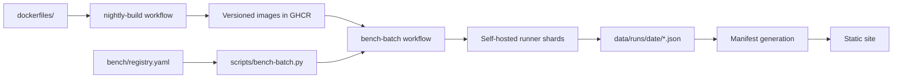

# Benchmark pipeline design

This document describes the repository-owned pipeline that builds inference
images, executes benchmarks, and publishes reproducible results. It is the
shared contract for contributors changing recipes, runners, images, result
records, or automation.

The design is intentionally independent of any particular lab network or fleet
manager. Machine addresses, login details, secret values, private mirrors, and
operator-specific inventory do not belong in this document.

## Goals

- Keep benchmark definitions and results reviewable in Git.
- Run the same online-serving methodology across engines and hardware targets.
- Record enough immutable provenance to reproduce or invalidate every result.
- Allow independent runner shards to make incremental progress and resume safely.
- Separate image production, benchmark execution, and site presentation.
- Make human and automated contributions coexist without a mutable central
  benchmark database.

## Non-goals

- Provisioning or administering self-hosted runners.
- Defining organization-specific networking, credentials, or access policy.
- Scheduling workloads outside GitHub Actions.
- Treating workflow success as proof that a complete, trustworthy dataset was
  published.

## System overview

The repository is the control plane and the result store:

| Surface | Responsibility |
| --- | --- |
| `bench/registry.yaml` | Declarative model, quantization, and recipe catalog |
| `scripts/bench-batch.py` | Plan expansion, filtering, sharding, execution, result writing, and incremental publication |
| `scripts/run-all.sh` | Stable workflow entry point |
| `dockerfiles/` | Image definitions and image build tooling |
| `.github/workflows/nightly-build.yml` | Scheduled and targeted image production plus release verification |
| `.github/workflows/bench-batch.yml` | Scheduled and targeted benchmark orchestration |
| `data/runs/<YYYY-MM-DD>/` | Immutable, reviewable result records |
| `data/runs/SCHEMA.md` | Result contract and provenance requirements |
| `docs/methodology.md` | Measurement procedure and metric semantics |

There is no external dispatcher in the current path. GitHub Actions selects a
self-hosted runner by capability label, and that runner invokes the repository's
own planner directly.

## Pipeline stages

### 1. Declare the benchmark catalog

The registry describes models, artifacts, quantizations, and canonical recipes.
Host profiles in the planner map those recipes to supported backends and images.
The expanded plan is deterministic for a given repository revision and CLI input.

Before merging a catalog or host-profile change, run the planner in `--dry-run`
mode for every affected target and review:

- the number of expanded entries;
- model, quantization, backend, and concurrency coverage;
- generated result identities;
- shard assignment; and
- image selection.

Do not hand-derive result filenames when the writer can generate them.

### 2. Build and verify images

The image workflow runs before the benchmark workflow. It builds source-based
profiles and mirrors approved upstream profiles, pushes them to GHCR, and then
verifies that every expected dated tag exists.

Mutable tags are selection pointers, not sufficient provenance. Every published
result must record the immutable manifest digest actually pulled by the runner.
The engine's self-reported version complements the digest; it does not replace
it.

The scheduled build and benchmark use the same UTC date. This lets the benchmark
select the image set produced earlier in that release window without a
cross-midnight naming ambiguity.

### 3. Plan and shard a benchmark run

The benchmark workflow expands one matrix job per physical runner shard. Three
identities must remain distinct:

- **runner label** selects the physical executor;
- **recipe host** selects the catalog and host profile; and
- **result host** is the public hardware identity written into result records.

This distinction allows equivalent machines to split one logical plan without
publishing results under the wrong device identity.

Sharding must be deterministic. A retry for the same measurement window uses the
same `run_date`, shard inputs, and `resume_existing=date`; it must not create a new
date merely because execution resumed later.

### 4. Execute an isolated measurement

Each unit follows the online-serving procedure in
[`methodology.md`](methodology.md): materialize the model, resolve the image,
start a fresh server container, wait for health, warm up, run the streaming
client, write the record, and remove the container.

Runner owners must keep the selected accelerator free of unrelated workloads.
A structurally valid JSON record can still be unusable if another process shared
the device during measurement.

### 5. Publish results incrementally

One JSON file is one measured scenario, and its relative path is its stable run
ID. Long jobs publish in small batches so completed work survives a later runner
or network failure.

Automated writers own generated result files. Human contributors should change
pipeline code and configuration through pull requests; corrections to generated
data require an explicit evidence trail in the commit or pull request.

Multiple runners may finish concurrently. A writer must reconcile with the
latest branch state before publishing and must never discard another writer's
results to resolve a push conflict.

### 6. Build the presentation layer

The site is derived from checked-in result JSON. Manifest generation and frontend
deployment are downstream consumers; they are not benchmark sources of truth.
Presentation code must tolerate historical optional fields as documented in
[`../data/runs/SCHEMA.md`](../data/runs/SCHEMA.md).

## Result acceptance gates

A workflow conclusion alone is not a data-quality gate. Before considering a
shard complete, verify all of the following:

1. Every expected result ID exists for the intended date and host.
2. Every file parses and conforms to the current writer contract.
3. Request counters show the expected number completed and zero failed.
4. Input and output token counts match the scenario.
5. Image digest, engine version, command, source URL, and Actions log URL are
   present where required.
6. No unrelated accelerator workload overlapped the measurement window.
7. Same-configuration performance is checked against recent history. Large
   regressions are re-measured before publication rather than silently accepted
   or deleted.

Compare performance only when the hardware identity, scenario, engine, and image
provenance are compatible. A changed image digest is a new software point, not a
strict apples-to-apples regression sample.

## Failure and recovery

| Failure | Expected response |
| --- | --- |
| Image build or release verification fails | Do not treat that release window as benchmark-ready. Fix or rebuild the affected track first. |
| Runner is offline | Leave its shard incomplete; do not publish another machine under that result host. |
| Runner loses GitHub communication | Inspect the physical runner for a live process, stale container, and untracked result files. GitHub may mark the job failed while local work remains. |
| Benchmark process is interrupted | Validate completed local records, then either publish them or remove them before the next checkout. |
| Git push conflicts | Fetch and reconcile; preserve all non-conflicting generated records. |
| External accelerator workload is detected | Stop or postpone the shard and re-run measurements that may overlap. |
| One scenario fails transiently | Retry the smallest exact filter with the original `run_date`; verify that the dry-run plan contains the intended entry. |

A recovery is complete only when the repository result count, runner worktree,
running containers, and Actions state agree. Do not infer completion from any one
of those views.

## Collaboration model

### Change ownership

| Change | Required review focus |
| --- | --- |
| Methodology or metrics | Statistical meaning, cross-engine comparability, and documentation |
| Registry or planner | Expanded plan, stable IDs, supported host profiles, and dry-run output |
| Image definition | Source revision, architecture, release tags, and digest verification |
| Workflow matrix | Runner capability, recipe/result identity, sharding, and retry behavior |
| Result schema or writer | Backward-compatible readers, provenance, and manifest generation |
| Generated results | Completeness, structural validity, isolation, and performance sanity |

### Pull request discipline

- Keep methodology, pipeline, and bulk result changes separable when practical.
- State the affected targets and include the relevant dry-run plan summary.
- Do not include credentials, addresses, login commands, or private inventory.
- Do not rewrite historical results as a side effect of formatting or frontend
  work.
- Update this document when an ownership boundary or pipeline stage changes.

### Adding a hardware target

1. Choose a stable public host slug and document the hardware identity.
2. Add a planner host profile with supported backends and image defaults.
3. Add or extend declarative recipes in the registry.
4. Add an image build or mirror track when existing profiles are incompatible.
5. Register a self-hosted runner with repository-scoped capability labels.
6. Add a workflow matrix entry, including deterministic sharding if machines
   share a logical plan.
7. Review a full dry-run and run a targeted smoke measurement without publishing.
8. Validate provenance and metrics from the generated record.
9. Enable scheduled publication only after the smoke result passes the acceptance
   gates.

## Public and operational boundaries

Public repository documentation may contain hardware slugs, capability labels,
image repositories, commands, schema, and reproducibility evidence. Operational
inventory stays outside the repository:

- network addresses and topology;
- remote-login aliases, usernames, and access instructions;
- secret names beyond the workflow contract, secret values, or tokens;
- private service endpoints and mirrors; and
- transient run progress or incident-specific host state.

This boundary keeps the pipeline portable for new collaborators while preserving
the evidence needed to audit every published benchmark.